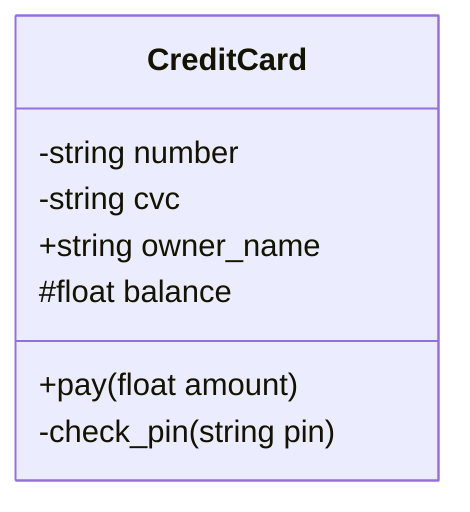

```mermaid
classDiagram
    class CreditCard {
        -string number
        -string cvc
        +string owner_name
        #float balance
        +pay(float amount)
        -check_pin(string pin)
    }
```
