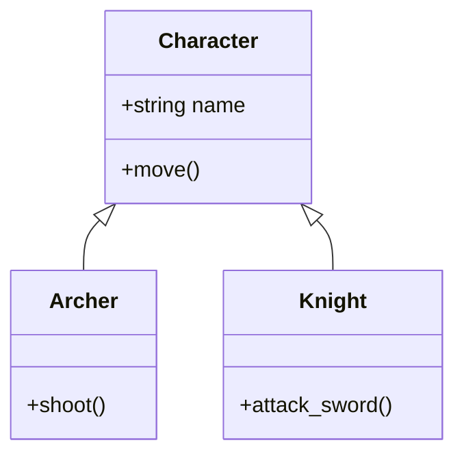

```mermaid
classDiagram
    class Character {
        +string name
        +move()
    }
    
    class Archer {
        +shoot()
    }
    
    class Knight {
        +attack_sword()
    }
    
    Character <|-- Archer
    Character <|-- Knight
```
