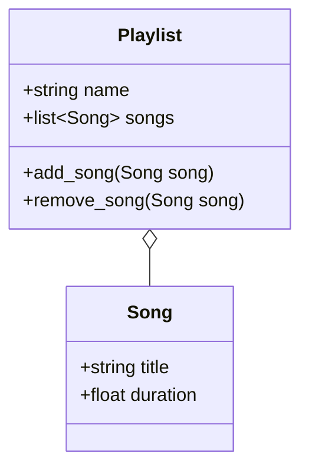

```mermaid
classDiagram
    class Song {
        +string title
        +float duration
    }
    
    class Playlist {
        +string name
        +list~Song~ songs
        +add_song(Song song)
        +remove_song(Song song)
    }
    
    Playlist o-- Song
```
