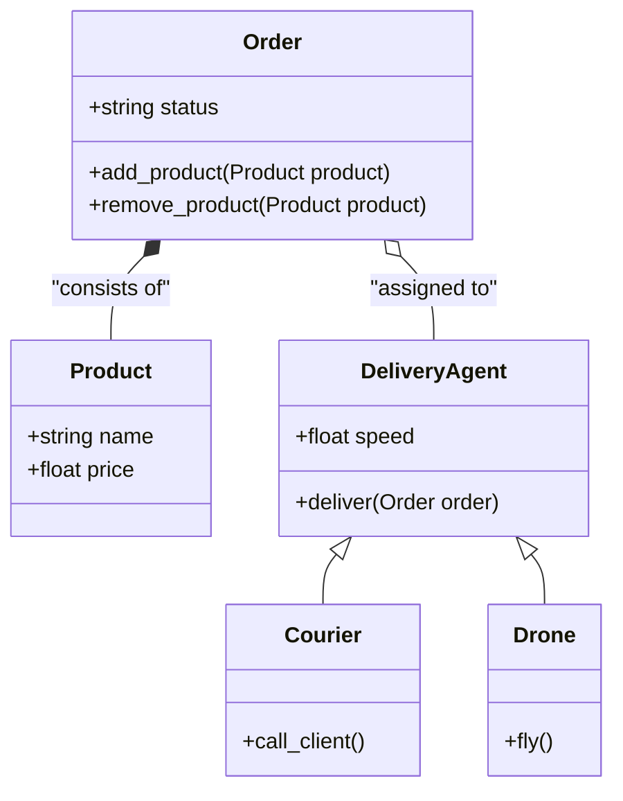

```mermaid
classDiagram
    class Product {
        +string name
        +float price
    }
    class Order {
        +string status
        +add_product(Product product)
        +remove_product(Product product)
    }
    class DeliveryAgent {
        +float speed
        +deliver(Order order)
    }
    class Courier {
        +call_client()
    }
    class Drone {
        +fly()
    }
    Order *-- Product : "consists of"
    Order o-- DeliveryAgent : "assigned to"
    DeliveryAgent <|-- Courier
    DeliveryAgent <|-- Drone
```
