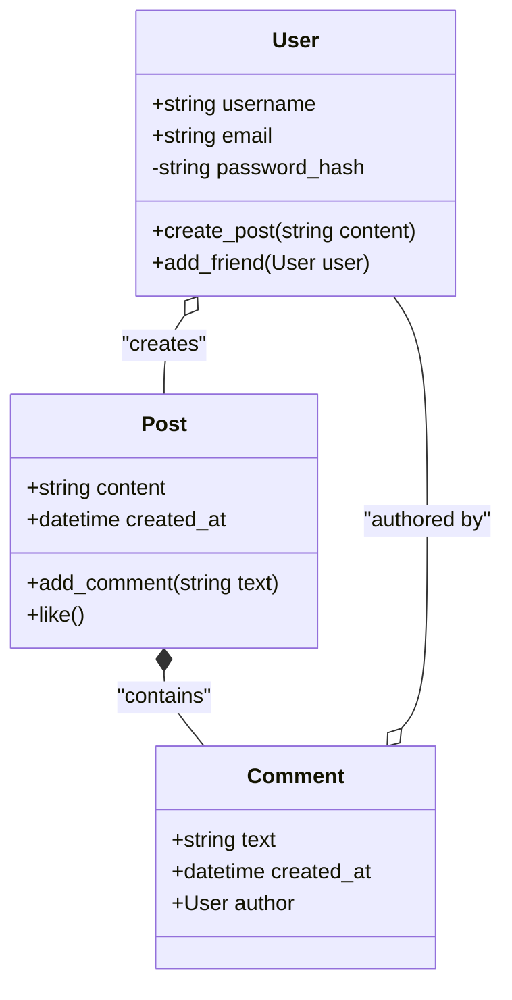

```mermaid
classDiagram
    class User {
        +string username
        +string email
        -string password_hash
        +create_post(string content)
        +add_friend(User user)
    }
    
    class Post {
        +string content
        +datetime created_at
        +add_comment(string text)
        +like()
    }
    
    class Comment {
        +string text
        +datetime created_at
        +User author
    }
    
    User o-- Post : "creates"
    Post *-- Comment : "contains"
    Comment o-- User : "authored by"
```
